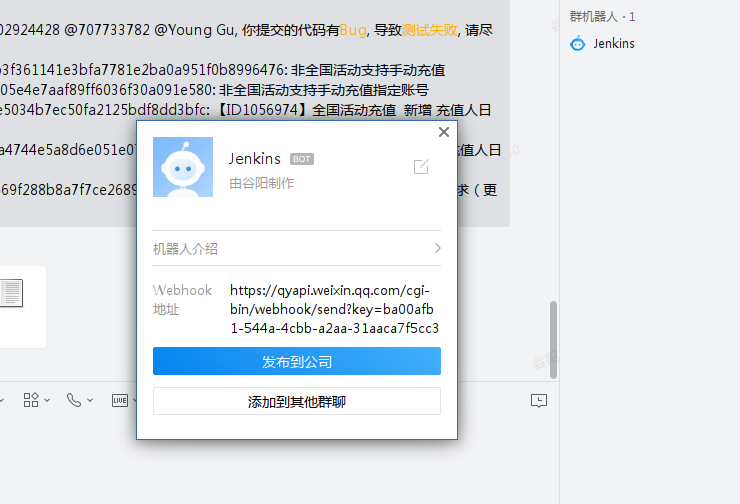
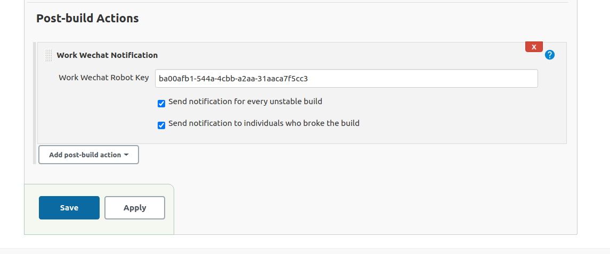

# Jenkins Work Wechat notification

Just send the build notification to the work wechat group by robot.

## 功能描述

通过群机器人发送build信息和build日志到群里， 并@导致build失败的开发人员。具有以下特性：
1. 当build失败时，通知上一次build成功到这次build失败期间提交代码的所有开发人员。
2. 发送前5条提交日志。

## 用法

1. 创建群机器人，并获取群机器人的key。

	

2. 配置一个Post-build Actions, 选择： Work Wechat Notification 
   
    

That's all.